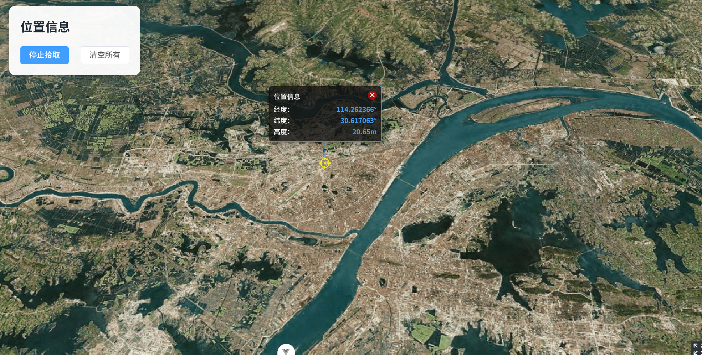
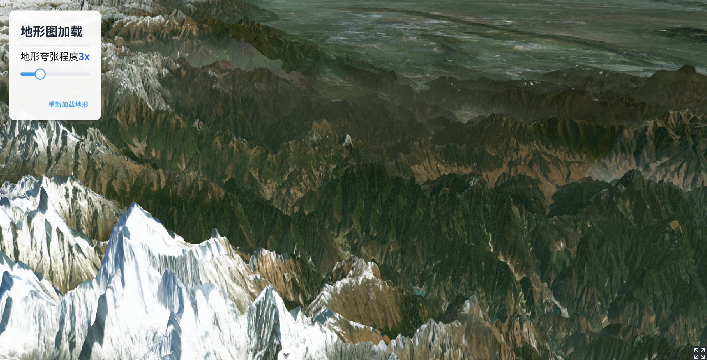
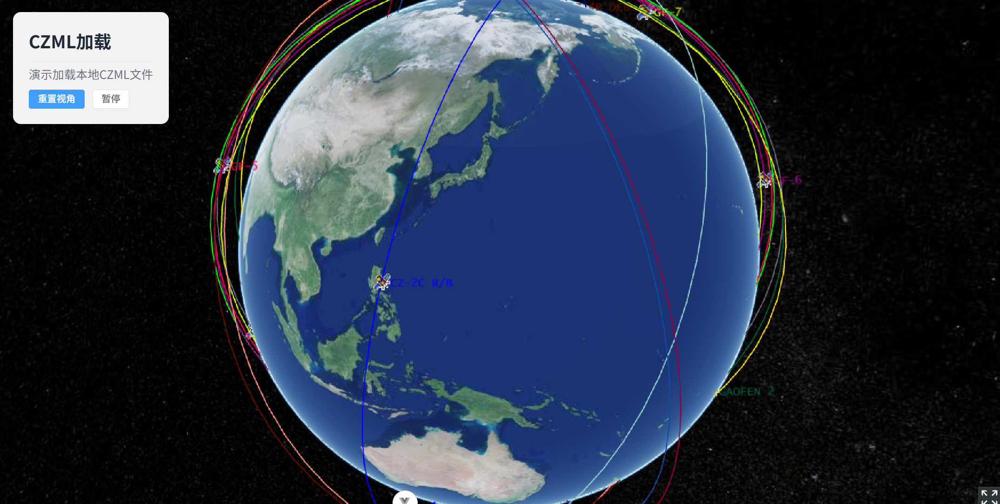
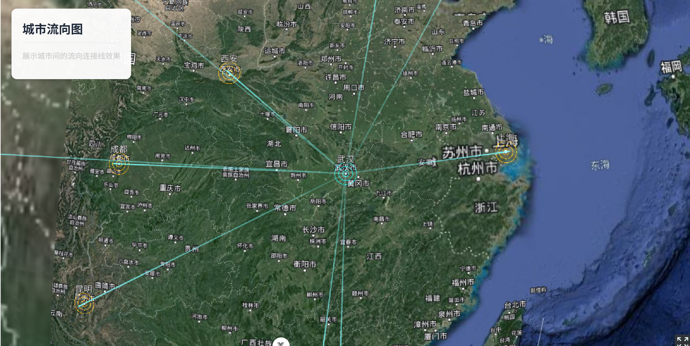
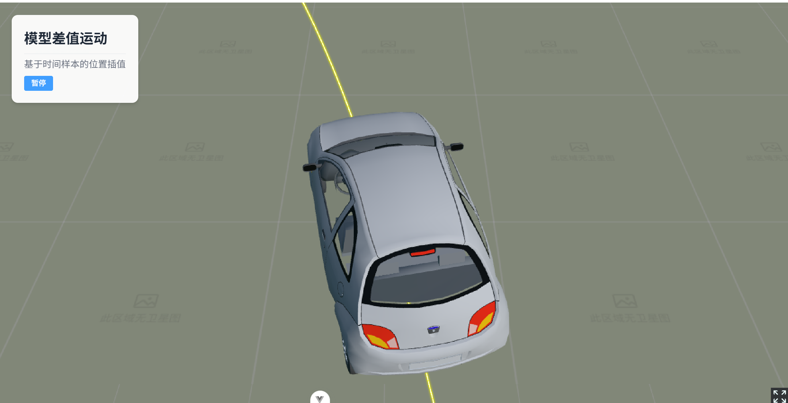
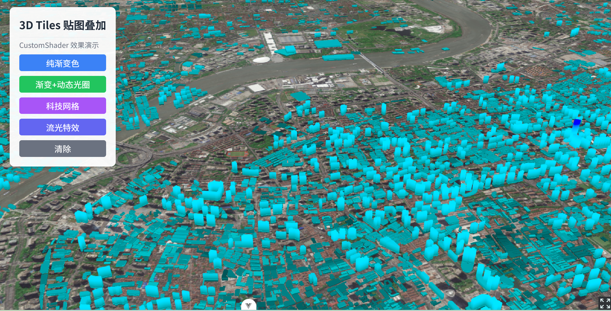
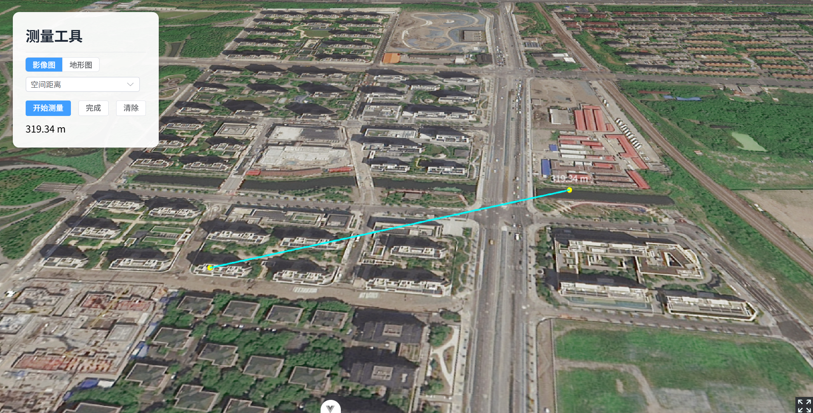
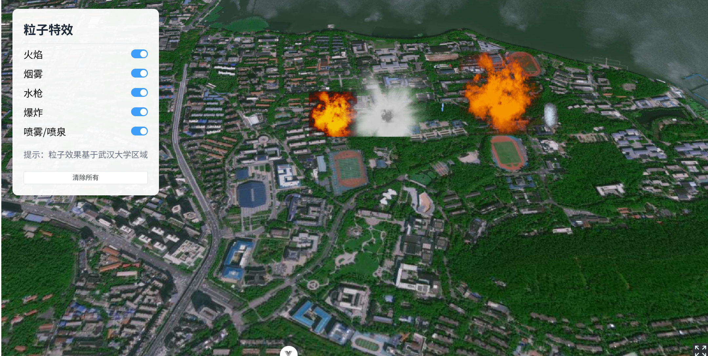

# Cesium ZZW - WebGIS 3D 可视化平台

基于 Vue 3 + Cesium 构建的 WebGIS 三维可视化演示平台，集成了丰富的地图功能、3D 可视化效果和空间分析工具。

## 功能特性

### 🎯 基础功能
- **实体加载**：点、线、面、椭圆等基础实体
- **定位功能**：坐标定位、视角控制
- **飞行漫游**：路径飞行、相机动画
- **运动轨迹**：实体运动、轨迹回放
- **信息提示**：鼠标悬停提示、信息标注
- **遮罩效果**：区域遮罩、边界遮罩
- **Shapefile 加载**：shp 文件解析与渲染
- **MVT 矢量瓦片**：矢量瓦片加载与样式
- **缩放控制**：自定义缩放按钮
- **透明效果**：图层透明度控制
- **绕点飞行**：相机绕点旋转


### 🗺️ 图层服务
- **单张图片**：本地图片叠加
- **XYZ 服务**：标准 XYZ 瓦片
- **TMS 服务**：Tile Map Service
- **WMS 服务**：Web Map Service
- **WMTS 服务**：Web Map Tile Service
- **天地图**：国产地图服务
- **EPSG:4490**：CGCS2000 坐标系支持
- **高德地图**：国内主流地图
- **Mapbox**：Mapbox 卫星图
- **动态地图**：实时更新的地图服务
- **离线地形**：本地地形数据加载


### 📦 实体元素
- **基础实体**：点、线、面、标注
- **广告牌**：Billboard 图标标注
- **海量广告牌**：大规模点数据渲染
- **弹窗信息**：自定义 Popup 弹窗
- **GeoJSON**：GeoJSON 数据加载
- **图元几何**：Primitive 高性能渲染
- **实体集合**：EntityCollection 批量管理
- **事件交互**：鼠标点击、悬停事件
- **SVG 图标**：矢量图标渲染
- **GIF 动画**：动态图片标注
- **点聚合**：大规模点数据聚合
- **CZML**：时间动态数据可视化


### ✨ 可视化效果
- **流动线**：脉冲线、流动箭头、轨迹线
- **雷达扫描**：圆形雷达扫描效果
- **水波纹**：扩散水波纹动画
- **扩散点**：圆环扩散动画
- **电子围栏**：动态发光围栏
- **移动锥体**：动态锥体效果
- **移动视锥体**：视锥体可视化
- **点光源**：动态光照效果
- **城市流动**：城市数据可视化


### 🏗️ 模型功能
- **模型加载**：GLTF/GLB 模型加载
- **图元模型**：Primitive 方式加载模型
- **海量模型**：大规模模型渲染
- **模型插值**：平滑运动插值
- **模型信息**：属性查询与展示
- **风力涡轮机**：动态风机模型


### � 3D Tiles
- **纹理替换**：自定义纹理贴图
- **模型信息**：3D Tiles 属性查询



### 📐 空间测量
- **测量工具**：距离、面积、高度测量


### 🌤️ 粒子特效
- **粒子示例**：火焰、烟雾、喷泉等粒子效果


### 🌌 天空盒
- **基础天空盒**：默认天空盒
- **近地天空盒**：近地视角天空盒
- **地面天空盒**：地面视角天空盒


## 技术栈

- **前端框架**：Vue 3 + Composition API
- **地图引擎**：Cesium
- **UI 组件**：Element Plus
- **状态管理**：Pinia
- **路由管理**：Vue Router
- **国际化**：Vue I18n
- **构建工具**：Vite
- **空间计算**：Turf.js、Proj4js

## 项目结构

```
cesium_zzw/
├── public/                 # 静态资源
├── src/
│   ├── api/               # API 接口
│   ├── assets/            # 资源文件（图片、模型等）
│   ├── components/        # 公共组件
│   ├── hooks/             # 自定义 Hooks
│   ├── layout/            # 布局组件
│   ├── locales/           # 国际化配置
│   ├── router/            # 路由配置
│   ├── store/             # 状态管理
│   ├── utils/             # 工具函数
│   │   └── cesium/        # Cesium 相关工具
│   ├── views/             # 页面视图
│   │   ├── base/          # 基础功能
│   │   ├── layers/        # 图层服务
│   │   ├── elements/      # 实体元素
│   │   ├── effects/       # 可视化效果
│   │   ├── models/        # 模型功能
│   │   ├── 3Dtiles/       # 3D Tiles
│   │   ├── measurement/   # 空间测量
│   │   ├── particleEffect/# 粒子特效
│   │   └── skyBox/        # 天空盒
│   ├── App.vue
│   ├── main.js
│   └── style.css          # 全局样式
├── .gitignore
├── package.json
└── vite.config.js
```

## 快速开始

### 环境要求

- Node.js >= 20.19.0 或 >= 22.12.0
- npm 或 pnpm

### 安装依赖

```bash
npm install
```

### 配置密钥

部分功能需要配置第三方服务密钥，请创建 `src/token.js` 文件：

```javascript
// Mapbox 密钥
export const MAPBOX_TOKEN = "your_mapbox_token";

// 天地图密钥
export const TIANDITU_TOKEN = "your_tdt_token";
```

### 开发运行

```bash
npm run dev
```

### 生产构建

```bash
npm run build
```

## 许可证

MIT License

## 作者

zhangzhiwei
